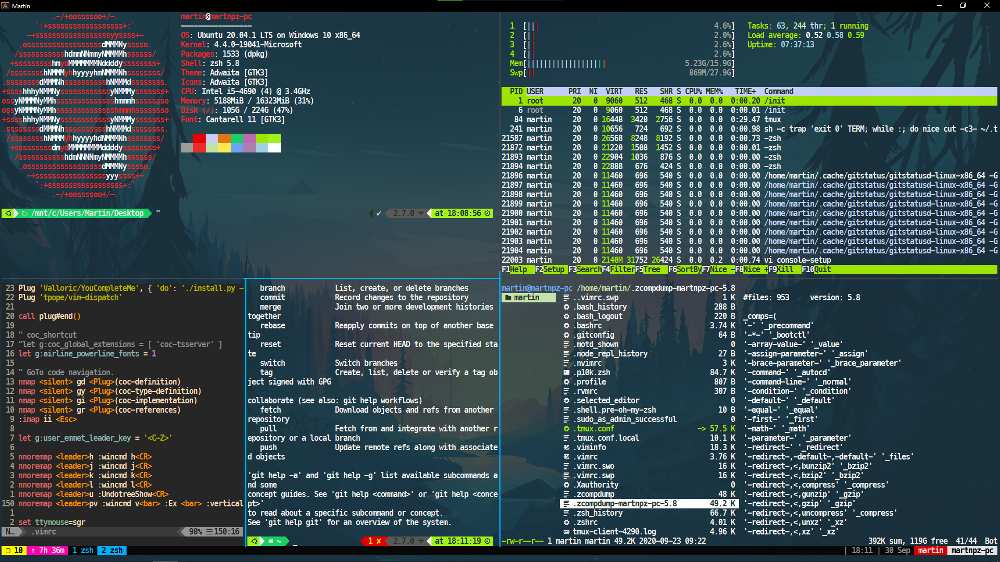

# DotFiles
Linux's configs: Arch, Ubuntu, WSL.




# For Windows
 
 We need
 1. WSL enable
 2. Chocolatey
 3. Xserver https://sourceforge.net/projects/vcxsrv/
 4. Ubuntu system from Microsoft Store
 5. Font family ```MesloLGS NF``` from https://www.nerdfonts.com/

# Install

1. Clone repository
```
> git clone https://github.com/martnpz/DotFiles.git
 cd DotFiles/
```
2. Launch installer
```
> sh install.sh
```
3. wallpaper
```
> wget https://images.hdqwalls.com/download/small-memory-8k-2a-3840x2400.jpg
```

# Apps 

| App | Description               | Config                                                                  |
| -------------------------------------------------------------------     |-------------------------- | ------------------                                                      |
| **[Alacritty](https://github.com/alacritty/alacritty)**                 | Terminal                  | [>>](https://github.com/martnpz/DotFiles/tree/master/.config/alacritty) |
| **[Ranger](https://github.com/ranger/ranger)**                          | File exolorer on terminal | [>>](https://github.com/martnpz/DotFiles/tree/master/.config/ranger)    |
| **[Nemo](https://wiki.archlinux.org/index.php/Nemo)**                   | File exolorer             |                                                                         |
| **[Vim](https://wiki.archlinux.org/index.php/Vim)**                     | Pain text editor          | [>>](https://github.com/martnpz/DotFiles/tree/master/.config/vim)       |
| **[Tmux](https://github.com/tmux/tmux/wiki)**                           | Multiplex                 | [>>](https://github.com/martnpz/DotFiles/tree/master/.config/tmux)      |
| **[Scrot](https://github.com/resurrecting-open-source-projects/scrot)** | Screen Capture            |
| **[Rofi](https://wiki.archlinux.org/index.php/Rofi)**                   | App launcher              |
| **[Min](https://www.archlinux.org/packages/community/any/min/)**        | Browser                   |
| **[Telegram-cli](https://github.com/vysheng/tg)**                       | Message app on terminal   |
| **[Telegram-desktop](https://wiki.archlinux.org/index.php/Telegram)**   | Message app               |
